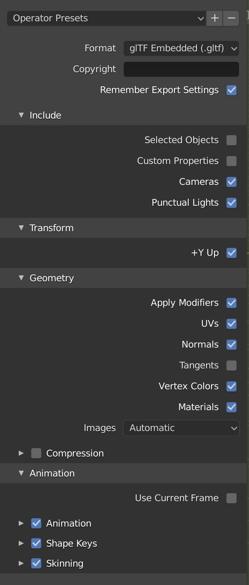
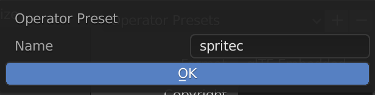
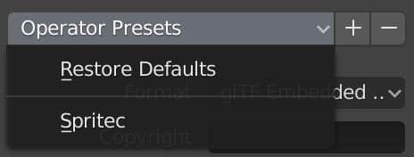
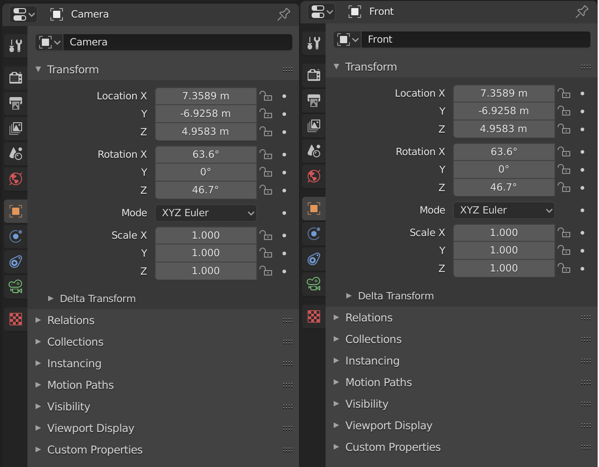
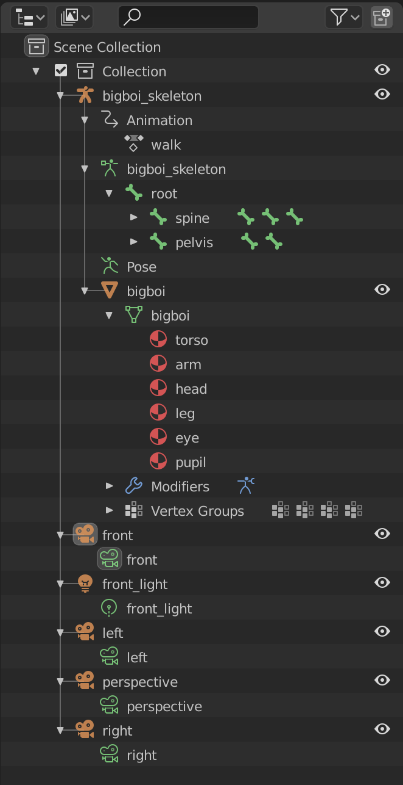

# spritec Tutorial

This is a tutorial for using `spritec` with the [Blender] 3D modelling tool. We
are using Blender 2.81, but any version of Blender compatible with that should
work as well.

## The spritec Command Line Tool

We are in the process of phasing out our command line tool in favor of a GUI
tool. In the meantime, here are some useful tips for using the CLI:

* `cargo install --path .` from the root directory of this repo will install
  the `spritec` command line tool
  * You need [Rust] installed in order to run that command
  * The easiest and best way to install Rust is via [rustup]
* The `spritec` tool takes one argument: a path to a config file (see below)
  * Example: `spritec samples/bigboi/spritec.toml`
  * If your config file is in the current directory and named `spritec.toml`,
    you can just run `spritec` with no arguments
  * You can run `spritec --help` to get some help information about running the
    tool
* The error messages produced by `spritec` may not be very useful right now
  (sorry!). If you run into something confusing, please get into contact with us
  or [open an issue] and we will help you out! 
* Common issues:
  * `Error: No such file or directory (os error 2)` 
    * You forgot to provide a path to `spritec` and/or it couldn't find your config
    * You provided a configuration file, but the glTF file you specified for your
      3D models wasn't found
  * `Error: unexpected character found: / at line 10 column 23` (or something)
    * There is a syntax error in your config file
    * The line number and column number should map to your `spritec.toml` file
  * `Error: Could not find any matching cameras in model file`
    * You specified a camera by name, but no camera with that name was found in
      the 3D model file
    * Check that you named the camera properly
  * `Error: invalid glTF: ...`
    * There was an error in your generated glTF file, try exporting again

## The spritec Configuration

To start, create a file called `spritec.toml` in the directory of the 3D models
you want to turn into sprites.

We are using the [TOML format] for our configuration file. Please see their docs
for more information.

The `spritec` tool is currently capable of generating two different types of
images:

* `spritesheets` - a regular grid of images with the frames of each animation on
  separate rows
* `poses` - a single image of a single frame of an animation

There are example `spritec.toml` files in the [`samples/`] directory of this
project.

Relative paths in the `spritec.toml` file are resolved based on the location of
the `spritec.toml` file itself.

The `spritec` tool uses [glTF] files as input. These files can be exported from
most popular 3D modelling/animation tools.

## Exporting from Blender

In [Blender], you can export a [glTF] file by clicking `File > Export > glTF 2.0 (.glb/.gltf)`.
That will open a dialog where you can select the file name and location for the
generated [glTF] file. There will be a sidebar where you should make sure your
settings match the image below:

To avoid having to remember these settings, it's a good idea to hit the "+" icon
beside "Operator Presets" at the top of that sidebar. You can then enter a name
(e.g. "spritec") and save those settings for next time:

Then, the next time you export, you can select "Spritec" from the "Operator
Presets" dropdown menu to restore the settings you had saved:

Now that you have a [glTF] file for your model, you can refer to it in the
`spritec.toml` file and generate your sprites!

## Naming Objects in Blender

Most objects can be named in Blender. You can name objects, meshes, cameras,
lights, etc. All objects can be named in the **Object Properties** panel:

The **Object Data Properties** panel also has a separate name field that you
should set as well.

You can check that you've set the names of your objects properly using the
"Outliner" Editor Type. For example, the `bigboi.blend` file from the
[`samples/`] directory shows the following:

All the meshes, objects, and cameras are named. The cameras and lights are named
the same thing twice, once in the **Object Properties** panel and once in the
**Object Data Properties** panel. This makes referring to them from the
`spritec.toml` file very easy.

[Blender]: https://www.blender.org
[Rust]: https://www.rust-lang.org/
[rustup]: https://rustup.rs
[`samples/`]: https://github.com/ProtoArt/spritec/tree/master/samples
[glTF]: https://www.khronos.org/gltf/
[open an issue]: https://github.com/ProtoArt/spritec/issues
[TOML format]: https://github.com/toml-lang/toml#toml
